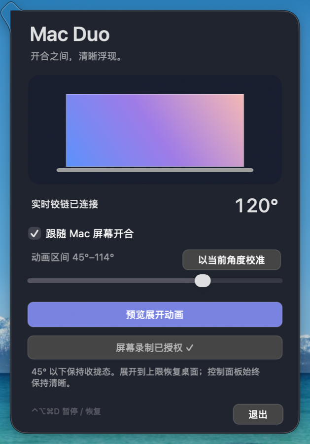
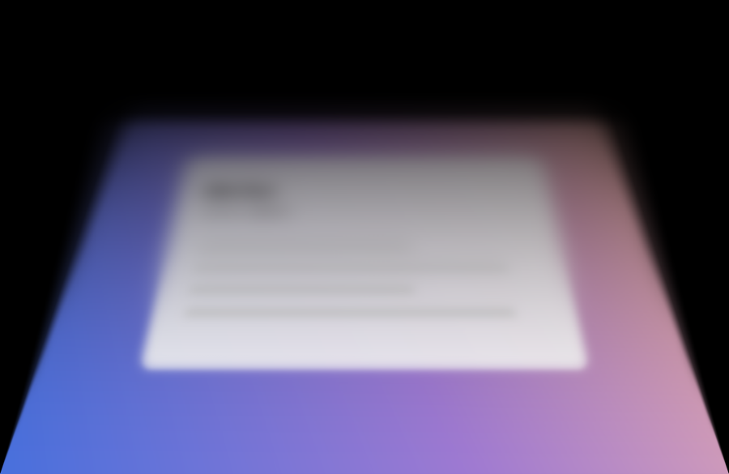
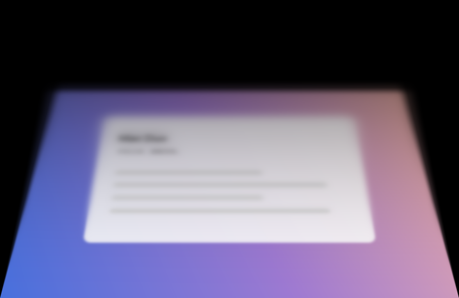
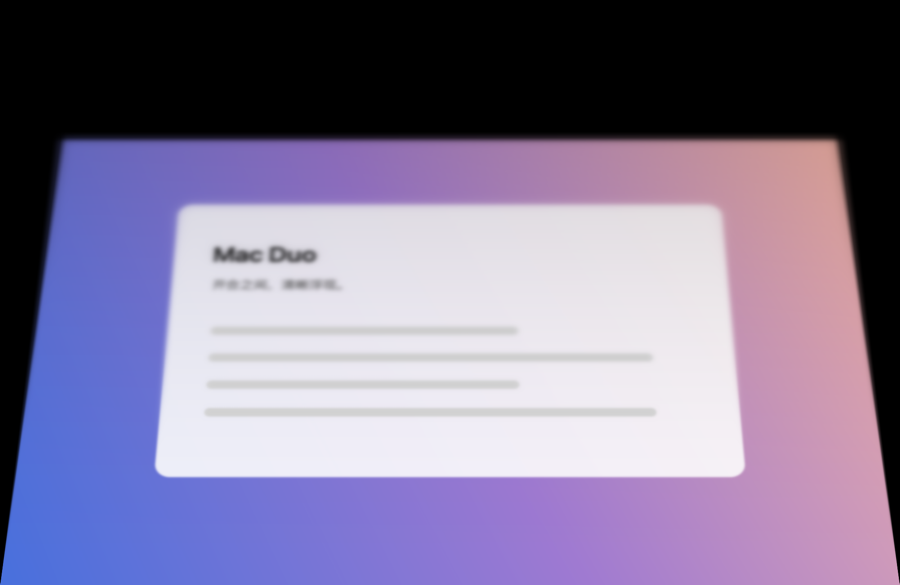
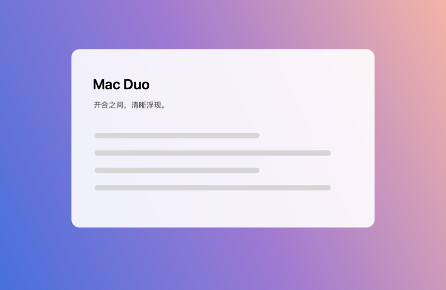

<div align="center">

# Mac Duo

**MacBook을 접으면 화면도 함께 접힙니다.**

실제 힌지 각도 → 실제 원근 → 실제 단계적 블러.
네이티브 구현, GPU 렌더링, 최대 120 Hz, 서드파티 의존성 없음.

[English](README.md) · [简体中文](README.zh-CN.md) · [日本語](README.ja.md) · **한국어**


<sub>합성 렌더링 스윕, 개방도 0 % → 100 % · 핑퐁 루프. 개인 데스크톱 화면은 포함되지 않습니다</sub>

[](#요구-사항)
[](#코드-구성)
[](#동작-원리)
[](#요구-사항)
[](LICENSE)

[](https://github.com/Toketec/mac-duo/releases/latest)
[](https://github.com/Toketec/mac-duo/stargazers)

</div>

---

폴더블 폰의 개폐 애니메이션을 만져 보고 "내 노트북도 이랬으면" 하고 생각했다면, 바로 그것입니다. 그것도 제대로 만든 버전입니다. MacBook의 **실제 힌지 각도**를 읽고, "나는 움직이지 않았다"는 고정 시점으로 데스크톱을 회전하는 패널에 재투영하며, 패널이 시선에서 멀어지는 방향으로 **물리적 근거가 있는 단계적 블러**를 더합니다. 그리고 화면이 완전히 펼쳐지는 순간 조용히 물러납니다.

타이머로 각도를 흉내 내지 않고, 슬라이더로 개폐를 흉내 내지 않습니다. 덮개가 1도 움직이면 영상도 1도 움직입니다.

> **범위를 분명히 합니다:** 폴더블 폰의 개폐 효과에서 착안해 MacBook 하단 힌지에 맞게 구현한 **독립적인 결과물**이며, iOS 애니메이션의 픽셀 단위 이식이 **아닙니다**. Apple 아트워크·펌웨어·비공개 프레임워크를 포함하지 않고, **문서화되지 않은** Apple HID 센서를 사용합니다([제약과 솔직한 주의](#제약과-솔직한-주의) 참고).

## 목차

- [하이라이트](#하이라이트)
- [동작 원리](#동작-원리)
- [컨트롤 패널](#컨트롤-패널)
- [각도 매핑](#각도-매핑)
- [요구 사항](#요구-사항)
- [빌드와 실행](#빌드와-실행)
- [검증과 벤치마크](#검증과-벤치마크)
- [성능 데이터](#성능-데이터)
- [프라이버시](#프라이버시)
- [코드 구성](#코드-구성)
- [FAQ](#faq)
- [제약과 솔직한 주의](#제약과-솔직한-주의)
- [크레딧](#크레딧)
- [라이선스](#라이선스)

## 하이라이트

| | |
|---|---|
| 🔗 **실제 각도 추적** | 움직일 때 **8 ms**, 정지 시 **33 ms**로 힌지 각도를 샘플링하고 시간 기반으로 평활화합니다. 오버슈트 없음. |
| 📐 **고정 시점 투영** | 시점을 키보드 공간에 고정해, 패널이 회전해도 내용 상단의 물리적 높이가 유지됩니다. 즉 "늘어남"이 아니라 "접힘"으로 보입니다. |
| 🌫️ **진짜 가우시안 블러** | 1 → 1/2 → 1/4 → 1/8 Metal Performance Shaders 가우시안 피라미드를 반지름으로 연속 합성합니다. 불투명도 페이드가 아닌 심도 표현입니다. |
| ⚡ **120 Hz, GPU 상주** | CADisplayLink가 내장 디스플레이를 따르고, 원근과 블러는 GPU에서 재사용 가능한 공유 버퍼로 기록됩니다. 프레임마다 `malloc`도, CPU 전체 화면 복사도 없습니다. |
| 🪟 **메뉴 막대 네이티브** | accessory 앱으로 실행되며 팝오버 패널을 사용합니다. 오버레이는 클릭을 통과하고 키보드 포커스를 빼앗지 않습니다. |
| 🔒 **의존성 없음** | Apple Command Line Tools와 시스템 프레임워크만 사용합니다. 패키지 다운로드도, 네트워크도 없습니다. |
| 🙈 **데이터는 기기를 떠나지 않음** | 덮개가 움직이는 동안에만 프레임을 캡처하고 메모리에서 처리합니다. 저장도, 업로드도 하지 않습니다. |

## 동작 원리

```
┌──────────────┐   HID 피처 리포트   ┌──────────────────┐    Metal + MPS   ┌──────────────┐
│ 힌지 센서     │ ─────────────────► │ FoldState        │ ───────────────► │ 오버레이      │
│ (읽기 전용)   │  8 ms / 33 ms 적응 │ 매핑·평활화·프리뷰 │  원근 + 가우시안  │ 내장 화면만   │
└──────────────┘                    └──────────────────┘   + 어둡게 처리   └──────────────┘
```

1. **측정.** 읽기 전용 IOKit HID 피처 리포트로 현재 힌지 각도를 얻습니다. 리포트를 쓰지 않고 센서 보정도 건드리지 않습니다. 폴링 주기는 움직임에 적응하며(이동 시 8 ms, 정지 시 33 ms), 리포트가 끊기면 스스로 연결을 끊고 다시 연결합니다.
2. **매핑.** `FoldMath.openness`가 각도를 진행도로 매핑하고 범위는 교정할 수 있습니다. `FoldMath.referenceUV`는 **고정 시점**에서 레이/평면 교차로 모든 픽셀을 재투영합니다. 시점은 패널 길이의 `2.4 ×` 앞, 높이는 완전히 펼친 패널 상단의 월드 높이에 맞춥니다. 패널이 회전해도 이 높이는 그대로여서 동작이 "눌린" 것이 아니라 "접힌" 것으로 읽힙니다. 힌지 모서리가 고정 축이고, 위쪽 여백은 검은색, 물리 화면을 벗어난 투영은 늘리지 않고 잘라냅니다.
3. **렌더링.** 투영 결과는 다단계 가우시안 피라미드를 거쳐 반지름으로 연속 합성되고 힌지 쪽으로 어두워집니다. 완성된 프레임은 GPU가 재사용 가능한 공유 버퍼에 기록하고 네이티브 AppKit 뷰가 그립니다. 투명 메뉴 막대 앱에서 `CAMetalLayer`가 일으키는 표시 문제를 의도적으로 피한 구조입니다.

각 계층의 타이밍은 독립적입니다. 기하는 display link(최대 120 Hz), 데스크톱 소스는 최대 60 Hz, 센서는 최대 125 Hz. `FoldState`는 지수 접근으로 평활화하고(시정수 45 ms, 오버슈트 없음) 45° 이하에서는 접힌 종단 상태를 유지하므로 보이지 않는 구간에서 전환 진행도를 낭비하지 않습니다.

## 컨트롤 패널

<div align="center">


<sub>실시간 힌지 각도, 교정 가능한 애니메이션 범위, 원클릭 프리뷰, 권한 상태가 모두 메뉴 막대 팝오버 안에 있습니다.</sub>
</div>

패널은 의도적으로 불투명하며 눌림·선택·포커스 해제 상태에서도 텍스트 대비를 유지합니다. 애니메이션 오버레이보다 **위**에 떠서 뒤의 효과를 보면서 설정을 조정할 수 있습니다. 패널 자체는 항상 선명하며 접힘 효과가 적용되지 않습니다.

## 각도 매핑

<div align="center">
<table>
<tr>
<td></td>
<td></td>
<td></td>
<td></td>
<td></td>
</tr>
<tr align="center">
<td><sub>접힘</sub></td>
<td><sub>25 %</sub></td>
<td><sub>50 %</sub></td>
<td><sub>75 %</sub></td>
<td><sub>데스크톱 복귀</sub></td>
</tr>
</table>
</div>

| 힌지 각도 | 화면 |
|---|---|
| **≥ 상한**（기본 **135°**） | 효과 꺼짐 — 원래 데스크톱 그대로, 오버헤드 없음. |
| **상한 → 45°** | 연속 접힘: 원근, 단계적 블러, 힌지 어둡게 처리가 실시간으로 따라갑니다. |
| **≤ 45°** | 접힌 종단 상태 유지 — 실제로 보이지 않는 구간은 애니메이션하지 않습니다. |
| **교정** | "완전히 선명하게" 하고 싶은 각도에서 덮개를 멈추고 **현재 각도로 교정**을 누르면 됩니다(65°–135° 제한). 하드웨어는 바꾸지 않고 매핑만 조정합니다. |
| **센서 손실 / 완전히 닫힘** | 자동으로 선명한 데스크톱으로 복귀하고, 리더가 스스로 재연결합니다. |

## 요구 사항

- Apple Silicon Mac(이 저장소는 M2 Max에서 빌드·측정)
- macOS 14 이상
- Apple Command Line Tools(`xcode-select --install`) — Xcode 프로젝트도 패키지 관리자도 필요 없음
- 화면 기록 권한(완전한 데스크톱 효과에 필요) — *선택이지만 여기서 가장 많이 걸립니다:* 없으면 앱이 어두운 블러/어둡게 처리 오버레이로 폴백해 **검은 화면**처럼 보입니다([빌드와 실행](#빌드와-실행)의 주의 사항 참조).

## 빌드와 실행

### 빌드된 바이너리(가장 빠름)

**⬇️ [최신 릴리스 다운로드](https://github.com/Toketec/mac-duo/releases/latest)** 로 바이너리를 받을 수 있습니다. 저장소의 `dist/`에도 바로 실행할 수 있는 **`Mac Duo.app`** 과 `MacDuo-1.2.0-arm64.zip`이 포함되어 있습니다 — Apple Silicon, macOS 14 이상, ad-hoc 서명.

```sh
git clone https://github.com/Toketec/mac-duo.git
cd mac-duo
xattr -dr com.apple.quarantine 'dist/Mac Duo.app'   # 다운로드 격리 플래그 해제
open 'dist/Mac Duo.app'
```

ad-hoc 서명이라 첫 실행 시 Gatekeeper가 확인을 요청합니다(우클릭 → "열기"도 가능). 최신 코드를 쓰려면 아래 소스 빌드가 가장 확실합니다.

### 소스에서 빌드

```sh
git clone https://github.com/Toketec/mac-duo.git
cd mac-duo

./scripts/build.sh      # 결과물: build/Mac Duo.app
./scripts/run.sh        # 필요하면 빌드 후 실행
```

빌드는 로컬 ad-hoc 서명이라 유료 개발자 인증서가 필요 없습니다. 다시 빌드할 때마다 재서명되므로 macOS가 화면 기록 권한을 다시 확인하라고 요청할 수 있습니다. 그다음:

1. 메뉴 막대의 노트북 아이콘 클릭 → "실제 데스크톱 효과 활성화".
2. *시스템 설정 → 개인정보 보호 및 보안 → 화면 및 시스템 오디오 기록*에서 **Mac Duo**를 허용합니다(종료 후 다시 열라고 요청할 수 있습니다).
3. 덮개를 천천히 닫았다가 열면 애니메이션이 연속적으로 따라옵니다. 화면을 움직이지 않고 "펼침 애니메이션 미리보기"로 확인할 수도 있습니다.

> [!IMPORTANT]
> **실행했는데 새까맣고 자신의 데스크톱이 안 보이나요?** 화면을 캡처할 수 없을 때 쓰는 **기본 모드**(어두운 블러/어둡게 처리 폴백)입니다. 검은 화면은 **화면 기록 권한이 없거나 만료된** 상태의 모습입니다.
> 1. *시스템 설정 → 개인정보 보호 및 보안 → 화면 및 시스템 오디오 기록*에서 **Mac Duo**를 켜고, macOS가 요청하면 앱을 종료한 뒤 다시 엽니다.
> 2. **이미 켜져 있는데도 새까맙다면** 권한 항목이 만료된 것입니다(다시 빌드할 때마다 재서명되어 흔히 생깁니다). 같은 목록에서 **Mac Duo**를 선택해 **−**로 제거하고, **Mac Duo를 완전히 종료**한 뒤 **＋**로 다시 추가하고(`dist/Mac Duo.app` 선택 또는 앱을 목록으로 드래그) 스위치를 켭니다. **제거 후 재추가가 실제로 고치는 단계**이며, 기존 항목을 다시 체크하는 것만으로는 대개 해결되지 않습니다.
> 3. 앱을 다시 실행하고 "펼침 애니메이션 미리보기"로 확인하세요. 새까만 화면이 아니라 자신의 데스크톱이 접히는 것이 보여야 합니다.

단축키와 수명 주기: **⌃⌥⌘D**로 전역 일시정지/재개. 잠자기와 잠금 시 오버레이는 자동으로 숨고, 깨어나거나 잠금 해제된 뒤 복귀합니다. 앱을 종료하면 모두 멈춥니다 — 로그인 항목도 백그라운드 데몬도 없습니다.

## 검증과 벤치마크

```sh
./scripts/test.sh              # 로직·경계 테스트, diagnose, 프리뷰 렌더, 서명 검증
./scripts/test-native.sh       # 약 2초 실제 윈도우: CVPixelBuffer → Metal → AppKit 그리기
./scripts/test-performance.sh  # 약 6초 전체 화면 합성 부하, build/performance/result.json 기록
```

상태 테스트는 센서 리포트 디코딩, 45°/90°/135° 경계, 최대 각도에서의 투영 항등, 힌지 고정, 물리 패널과 함께 흐르지 않는 관찰 레이, 센서 손실 복구, 일시정지, 프리뷰 종료, 깨어남, 오버슈트 없는 평활화를 포함합니다.

GPU 검사는 합성 프레임과 세 가지 패널 상태를 렌더링하며 개인 데스크톱은 전혀 건드리지 않습니다. 추가 진입점:

```sh
'build/Mac Duo.app/Contents/MacOS/MacDuo' --diagnose
'build/Mac Duo.app/Contents/MacOS/MacDuo' --render-previews build/previews            # 5단계 개방도
'build/Mac Duo.app/Contents/MacOS/MacDuo' --render-previews build/sweep --sweep 41    # 고밀도 스윕(GIF용)
```

`--sweep N`은 등간격 개방도 `N`장을 렌더링합니다(`fold-000.png` … `fold-100.png`). 이 페이지 맨 위의 애니메이션이 바로 이 방법으로 만들어졌습니다. 기본 5단계 렌더 동작은 그대로라 `scripts/test.sh` 출력도 변하지 않습니다.

## 성능 데이터

`./scripts/test-performance.sh`를 M2 Max, 1512×982 데스크톱 소스, 60 Hz 소스 갱신, 120 Hz 기하 요청 조건에서 측정:

| 렌더러 | 초당 그리기 | 프레임 간격 P95 | 렌더 시간 P95 |
|---|---|---|---|
| **현재**(display link + 공유 버퍼) | ~120 | 8.56 ms | 7.07 ms |
| 이전(60 Hz `Timer`) | ~103 | 16.85 ms | 9.99 ms |

원본 JSON은 `build/performance/result.json`에 저장됩니다. 합성 부하 결과이며, 모든 데스크톱 부하와 모든 물리적 개폐에서 120 fps를 보장하지는 않습니다.

실시간 진단은 `~/Library/Application Support/MacDuo/status.json`에 기록됩니다(프로세스 ID, 각도, 권한, GPU 제출/완료/표시 프레임 수, 렌더 및 GPU 밀리초, 프레임 클록). **데스크톱 이미지는 포함하지 않습니다**. 터미널에서 `--diagnose`를 실행한 경우 권한 판독값은 그 진단 프로세스의 것이므로 상태 파일의 PID와 갱신 시각을 반드시 대조하세요.

## 프라이버시

- 화면 프레임은 덮개가 **움직이는 동안에만** 캡처합니다(`ScreenCaptureKit`, 피드백을 막기 위해 이 앱은 제외). 처리는 전부 GPU 메모리 안에서 이루어집니다.
- 저장하지 않고 업로드하지 않으며, 앱은 네트워크 연결을 열지 않습니다. 개발 중 참고 자료 조사는 로컬 프록시를 사용했고, 배포되는 앱의 외부 통신은 0입니다.
- 위 상태 파일에는 숫자만 들어 있습니다.

## 코드 구성

```
Sources/MacDuo/
├── LidSensor.swift      읽기 전용 IOKit HID 각도 샘플링(8/33 ms 적응)
├── FoldState.swift      각도 → 개방도 매핑, 평활화, 프리뷰, 손실 폴백
├── DesktopCapture.swift 필요할 때만 동작하는 ScreenCaptureKit 캡처(자기 앱 제외)
├── FoldRenderer.swift   고정 시점 재투영, MPS 가우시안 피라미드, 연속 합성과 어둡게 처리
├── Overlay.swift        내장 화면 전용 AppKit 이미지 오버레이와 기본 모드
├── ControlPanel.swift   메뉴 막대 팝오버 UI, 교정, 실시간 표시
├── App.swift            상태 항목, 핫키, display link, 잠자기/잠금 수명 주기
└── main.swift           진입점, --diagnose, --render-previews [--sweep N]
Resources/Fold.metal     투영과 다단계 가우시안 셰이딩
Tests/                   상태 테스트 · 네이티브 윈도우 테스트 · 성능 하네스
scripts/                 빌드, 실행, 세 가지 테스트 진입점
docs/images/             README 자산(합성 콘텐츠만)
dist/                    빌드된 Mac Duo.app과 zip(ad-hoc 서명, Apple Silicon)
```

## FAQ

**왜 화면이 새까맣고 내 데스크톱이 안 보이나요?** 앱이 폴백 **기본 모드**에 있기 때문입니다. 화면을 캡처할 수 없는 동안에는 데스크톱 대신 어두운 블러/어둡게 처리 오버레이를 보여주므로, 검은 화면은 거의 항상 화면 기록 권한이 없거나 만료되었다는 뜻입니다. *시스템 설정 → 개인정보 보호 및 보안 → 화면 및 시스템 오디오 기록*에서 허용하고 앱을 종료한 뒤 다시 여세요. 이미 켜져 있다면 **목록에서 Mac Duo를 제거한 뒤 다시 추가**하고 앱을 재시작하세요. 자세한 내용은 [빌드와 실행](#빌드와-실행)의 중요 안내를 참고하세요.

**잠자기 설정을 바꾸나요?** 아닙니다. 덮개를 닫으면 이전과 동일하게 잠자기로 들어가며, 화면이 꺼져 있는 동안에는 단순히 애니메이션이 보이지 않습니다.

**시작할 때 잠깐 기본 모드인 이유는?** 화면 캡처의 첫 프레임에 시간이 조금 걸리기 때문입니다. 그 전까지는 각도에 따른 블러/어둡게 처리 기본 모드를 쓰고, 이후 자동으로 완전한 효과로 전환됩니다.

**앉은 자세와 원근이 조금 다른 이유는?** 시점은 키보드 공간의 고정점이며 카메라로 눈을 추적하지 않습니다. 실제 자세가 착시의 설득력에 영향을 줍니다.

**Intel Mac이나 외부 디스플레이에서도 되나요?** 효과는 내장 화면에만 적용되고 센서 인터페이스는 Apple Silicon 세대의 것입니다. 측정한 기기 외에서의 동작은 보장하지 않습니다.

**비공개 API를 쓰나요?** **문서화되지 않았지만 읽기 전용**인 HID 센서 인터페이스(Apple 벤더, usage page `0x20`, usage `0x8A`, 피처 리포트 1)를 사용합니다. 비공개 프레임워크 호출, 펌웨어 변경, 쓰기는 전혀 없습니다.

## 제약과 솔직한 주의

- 폴더블 폰의 개폐에서 착안해 MacBook 하단 힌지에 맞춘 독립적인 근사 구현이며, iOS 애니메이션의 픽셀 단위 재현이 아닙니다.
- HID 각도 인터페이스는 문서화되지 않았습니다. 이 저장소의 기기에서 검증했으며 **모든 Mac에서 동작한다고 주장하지 않습니다**.
- 잠금 화면과 완전히 닫힌 상태는 macOS가 관리합니다. 잠금 해제 후 효과가 복귀합니다.
- 센서 연결이 끊기면 자동으로 선명한 데스크톱으로 돌아갑니다. 크래시도, 가짜 "접힘 자국"도 남지 않습니다.

## 크레딧

- 읽기 전용 HID 센서/리포트 조합은 [ResetPower26/LidSense](https://github.com/ResetPower26/LidSense)(MIT)를 기준으로 검증했습니다.
- 초기 공간 블러 연구는 [chuspeeism/iphone-duo](https://github.com/chuspeeism/iphone-duo)(MIT)를 참고했습니다.
- 이 저장소의 고정 시점 레이/평면 투영과 MPS 가우시안 파이프라인은 독자 구현입니다.

전체 고지는 [`THIRD_PARTY_NOTICES.md`](THIRD_PARTY_NOTICES.md)를 참고하세요.

실기기 데모 영상: [실기기 개폐 데모](https://www.bilibili.com/video/BV1Q5Ya6ZEB8/) · [펼침과 그라디언트](https://www.bilibili.com/video/BV1cXYb6KEA4/) — 분석용 참고 자료이며 앱에 포함되지 않습니다.

## 라이선스

[MIT](LICENSE) © 2026 Tony Wang (王圣滔)

<div align="center">
<br>
<b>노트북이 조금 더 재미있어졌다면, ⭐가 다른 사람들의 눈에 띄게 해 줍니다.</b>
<br><br>
<a href="https://star-history.com/#Toketec/mac-duo&Date">

</a>
</div>
